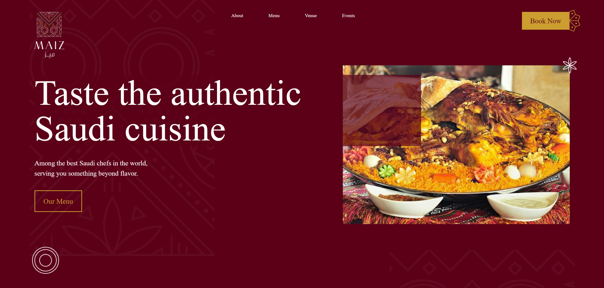
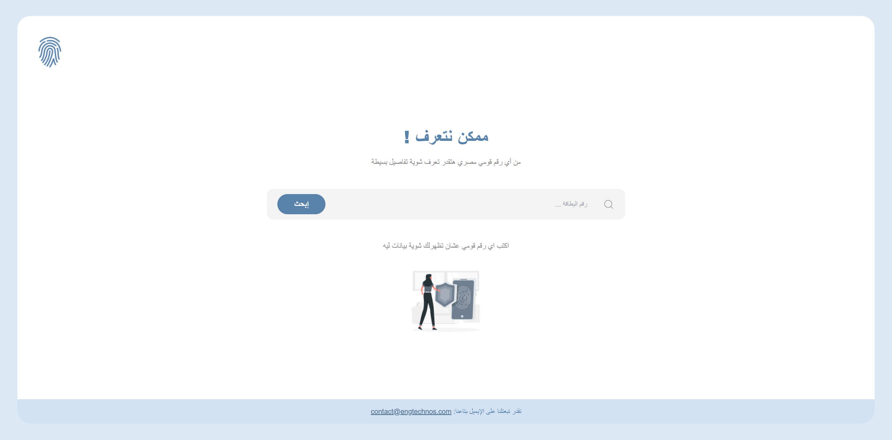
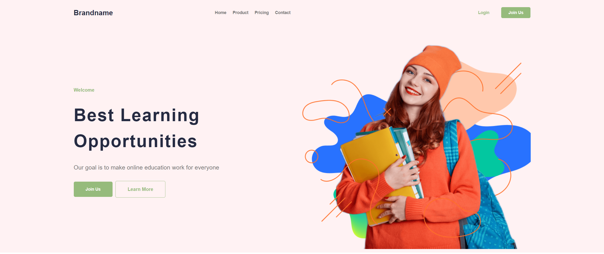
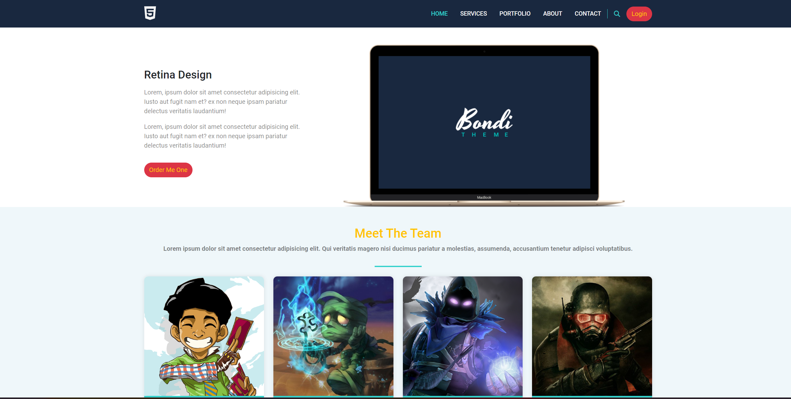
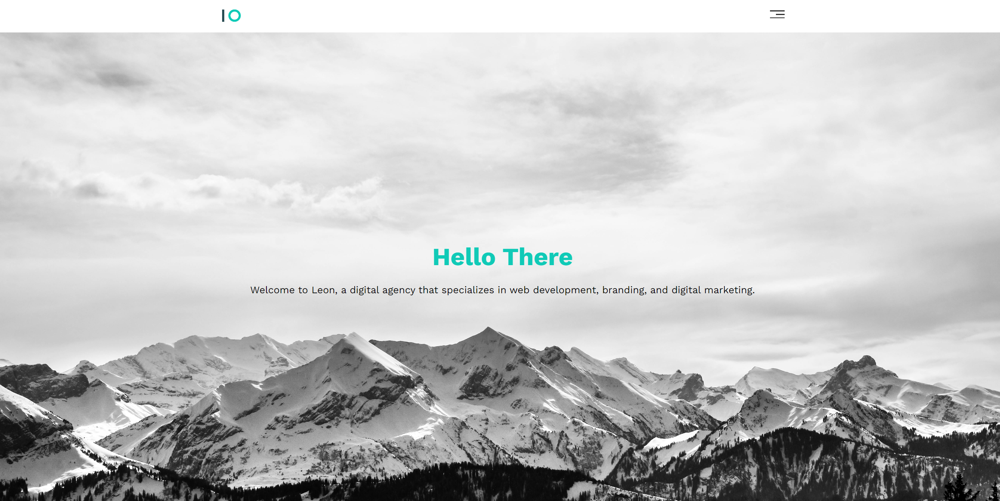

# Static Web Applications 🌐

Welcome to the **Static Web Applications** repository! 🎉 This repo serves as a collection of fully responsive static websites that I've built using HTML, CSS, and JavaScript. Each project focuses on different aspects of web design and development. Below you'll find live previews, repository links, and image previews of each static web app.

## Overview 📚

This repository showcases various **static web applications**, ranging from restaurant websites to e-learning platforms. These projects are fully responsive, with no back-end functionality, but demonstrate modern design techniques and clean layouts. Explore the live demos and check out the code in the repositories.

## Projects 🚀

### [Maiz](https://ahmedkamal14.github.io/Maiz/) 🍽️
A restaurant website for **Maiz**, featuring details about the restaurant’s menu, location, and more. It’s designed with responsiveness in mind, making it accessible across all devices.

- **[Live Preview](https://ahmedkamal14.github.io/Maiz/)**
- **[Repository](https://github.com/ahmedkamal14/Maiz)**

---

### [ID-Info](https://github.com/ahmedkamal14/ID-Info) 🆔
A static web application designed to retrieve and display personal information from an Egyptian national ID number. This project features a user-friendly interface and is fully responsive, providing a seamless experience for users to access ID-related data.

- **[Live Preview](https://ahmedkamal14.github.io/ID-Info)**
- **[Repository](https://github.com/ahmedkamal14/ID-Info)**

---

### [MindSet P1](https://ahmedkamal14.github.io/MindSet-P1/) 📘
An **e-learning platform** concept site. It is a simple, front-end-only design with no backend functionality. This project focuses on a clean and modern UI.

- **[Live Preview](https://ahmedkamal14.github.io/MindSet-P1/)**
- **[Repository](https://github.com/ahmedkamal14/MindSet-P1)**

---

### [Bondi Website Template](https://ahmedkamal14.github.io/Bondi_Website_Template_HTML_CSS/) 🖼️
A design template built to practice web development skills using **HTML** and **CSS**. It demonstrates how to structure a landing page with clean code and responsiveness.

- **[Live Preview](https://ahmedkamal14.github.io/Bondi_Website_Template_HTML_CSS/)**
- **[Repository](https://github.com/ahmedkamal14/Bondi_Website_Template_HTML_CSS)**

---

### [HTML and CSS Template 1](https://ahmedkamal14.github.io/HTML_AND_CSS_Template1/) 🎨
Another static design template used to learn **HTML** and **CSS**. It emphasizes responsive web design techniques and simple, clean layouts for educational purposes.

- **[Live Preview](https://ahmedkamal14.github.io/HTML_AND_CSS_Template1/)**
- **[Repository](https://github.com/ahmedkamal14/HTML_AND_CSS_Template1)**

---

## Features 🌟

- **Responsive Design**: Each project is fully responsive and adapts to different screen sizes. 📱💻
- **Clean Code**: Written using semantic HTML and modular CSS to maintain clean and efficient code. 💻
- **Modern UI Design**: Projects showcase minimalist and modern design trends in static websites. 🎨

## Technologies Used 💻

Here’s a list of technologies used in these projects:

- **Vite** 
- **React** 
- **Tailwind CSS** 
- **HTML** 
- **CSS** 
- **JavaScript** 
- **Bootstrap** 

## Getting Started 🏁

To explore any of the projects, click on the **Live Preview** links to view them in action, or check out the **Repository** links to dive into the code.

## License 📜

This project is licensed under the [MIT License](https://opensource.org/licenses/MIT). See the [LICENSE](LICENSE) file for details.
